# Exam Questions

These Questions are taken from examtopics.com

### 1

This question requires that you evaluate the underlined text to determine if it is correct.
You have a Power Apps app. You create a new version of the app and then publish the new version. A customer goes through the process of restoring the previous version of the app. In the Version tab for the app, you will see two versions of the app. Review the underlined text. If it makes the statement correct, select `No change is needed.` If the statement is incorrect, select the answer choice that makes the statement correct.

- A. No change is needed.
- B. one
- C. three
- D. four

> **Discussion**
>
> Answer is A
>
> Key point is that the customer does the restoration. So the developer would not see another version. If a developer would do the restoration  it should show up as a separate version. 
>
> Also See 17
>
> -----
>
> **Site Answer:** *C* [🗳️](https://www.examtopics.com/exams/microsoft/pl-900/view/#)
> Restore a canvas app to a previous version in PowerApps.
> 
> 1. Open powerapps.com, and then click or tap Apps in the left navigation bar.
> 2. Near the right edge, click or tap the info icon for the app that you want to restore.
> 3. Click or tap the Versions tab, and then click or tap Restore for the version that you want to restore.
> 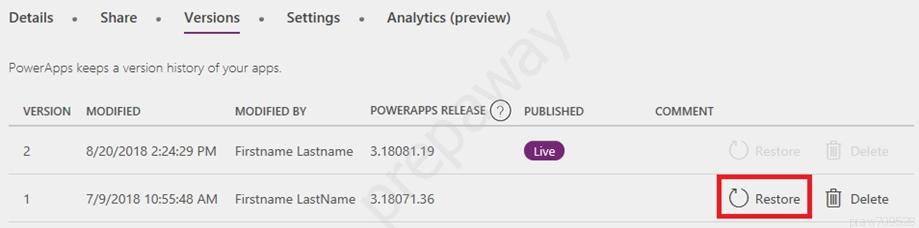
> 4. In the confirmation dialog box, click or tap Restore.
> A new version is added to your list.
> 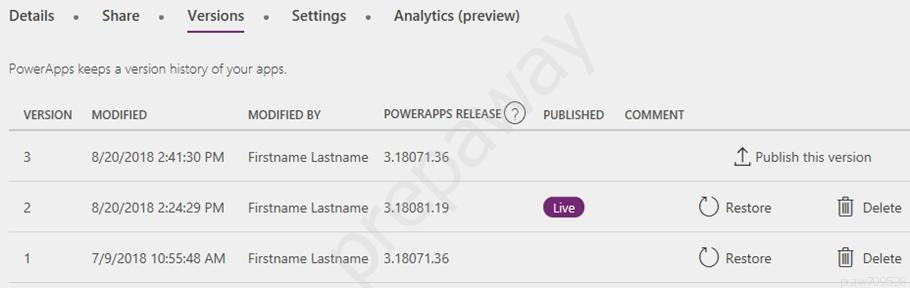
> Reference:
> https://docs.microsoft.com/en-us/powerapps/maker/canvas-apps/restore-an-app

### 2

A company uses Dynamics 365 Sales. The company uses a browser-based app named Sales Hub.
You need to ensure that users can access data from mobile devices. Which app should users install?

- A. Dynamics 365 Remote Assist
- B. Dynamics 365 Finance
- C. Dynamics 365 Business Central
- D. Dynamics 365 for Phones

>**Site Answer:** *D* [🗳️](https://www.examtopics.com/exams/microsoft/pl-900/view/#)
>Use the Dynamics 365 for phones and Dynamics 365 for tablets apps for your sales, customer service, field service, and other tasks when you're on the go. With one download from your app store, youג€™ll automatically have access to all the apps you need for your role. You will see apps with the new Unified Interface on your mobile device.
>Reference:
>https://docs.microsoft.com/en-us/dynamics365/mobile-app/dynamics-365-phones-tablets-users-guide

### 3

You are a customer service manager. You need to implement a Power Apps portal that allows customers to submit cases. Which type of data source is used?

- A. Dynamics 365 Connector
- B. Microsoft SharePoint
- C. Microsoft Azure Storage
- D. Common Data Service

> **Discussion**: D
>
> Answer D : PowerApps Portals, the ability to build low-code, responsive websites which allow external users to interact with the data stored in the Dataverse. https://powerapps.microsoft.com/en-us/blog/introducing-powerapps-portals-powerful-low-code-websites-for-external-users/
>
> -----
>
> **Site Answer:** *B* [🗳️](https://www.examtopics.com/exams/microsoft/pl-900/view/#)
> SharePoint can be set up to setup customer feedback.
>
> Note: The PowerApp uses Finance and Operations connector to grab sales order information and SharePoint connector to connect and write the data to SharePoint list. Reference:
> https://powerapps.microsoft.com/en-us/blog/scenario-2-collect-customer-feedback-in-sharepoint-after-order-delivery/

### 4

You create a user-owned custom entity by using Common Data Service. For each of the following statements, select Yes if the statement is true. Otherwise, select No.
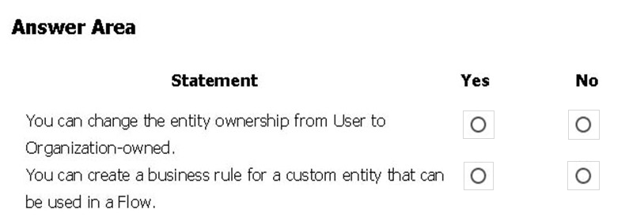

> **Site Answer:** 
> 
> 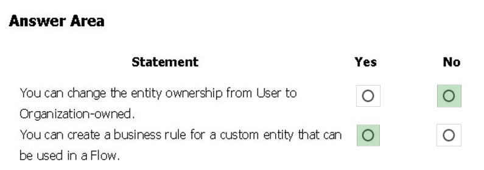
>
> Box 1: No -
> Common Data Service supports two types of record ownership. Organization owned, and User or Team owned. This is a choice that happens at the time the entity is created and can't be changed.
>
> Box 2: Yes -
> By combining conditions and actions, you can do any of the following with business rules:
>
> Set field values - Clear field values - Set field requirement levels - Show or hide fields - Enable or disable fields - Validate data and show error messages - Create business recommendations based on business intelligence.
>
> Reference:
> https://docs.microsoft.com/en-us/power-platform/admin/wp-security-cds

### 5

You need to explain the major components of the Common Data Model (CDM) and their functions. Match each term to its definition.

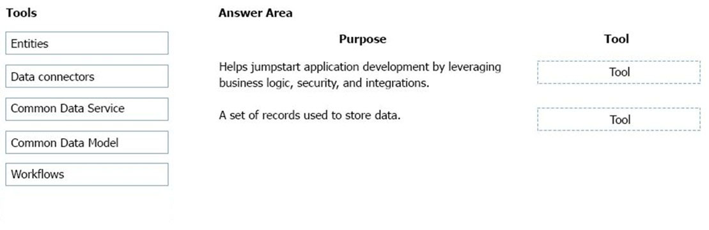

> **Site Answer:** 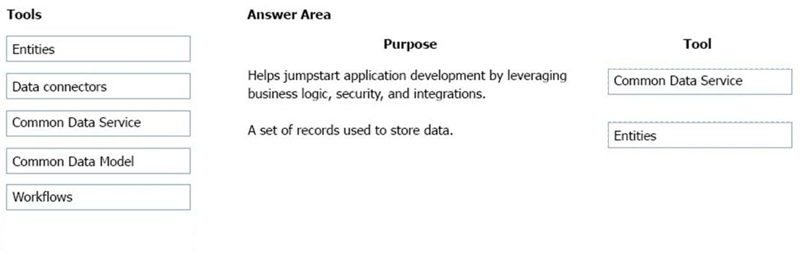
> >
> Box 1: Common Data Service / Dataverse
>
> By using Dataverse, you can jump-start app development by using the Common Data Model with business logic, security, and integration already built- in.
>
> Box 2: Entities -
> An entity is a set of records used to store data, similar to how a table stores data within a database.
>
> Reference:
> - https://docs.microsoft.com/en-us/common-data-model/use
> - https://docs.microsoft.com/en-us/powerapps/maker/common-data-service/data-platform-intro

### 6

A distribution company has multiple warehouses. Tax rates charged on sales orders need to be calculated based on locality and region. You need to recommend a cost-effective solution that can be implemented quickly. What should you recommend?

- A. Check AppSource for a tax add-on.
- B. Create alerts in Dynamics 365 Finance for tax table changes.
- C. Implement the Common Data Model.
- D. Run a Power BI report.
- E. Write scripts and code tax updates.

> **Discussion**
>
> "This is actually a question for D365 Finance and Operation. The answer is correct based from the link provided."
>
> "I am D365FO developer, so from my side, if tax rate code changed, D365FO is changed already based on setup/configure on tax period and other parameter on sales tax group code and item tax code combination. Alert is enough to give people that tax rate is changed. Why this question is so wierd? If D365 FO didn't fellow tax rate changed in time, this system is crashed and messedup. The web service call as Avalara for tax code is settup. Answer is B. Just flag tax code changed, that is it." 
>
> **Correct Answer:** *B* [🗳️](https://www.examtopics.com/exams/microsoft/pl-900/view/2/#)
> Reference:
> https://docs.microsoft.com/en-us/dynamics365/finance/general-ledger/indirect-taxes-overview

### 7

You manage the support team at a rapidly growing company. Customers and support technicians need a better experience when logging and responding to support requests. You need more visibility into what the support technicians are doing every week. You need to recommend tools to help the company's needs.

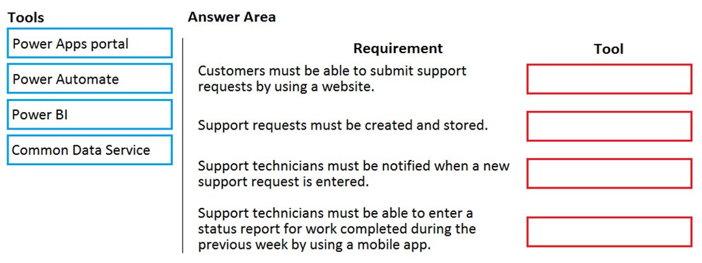

> **Discussion**
>
> 1. Power Apps Portal 
> 2. Common Data Service 
> 3. Power Automate 
> 4. Power BI

### 8

You are building Power Apps apps that use both Dynamics 365 Sales and Microsoft 365. For each of the following statements, select Yes if the statement is true. Otherwise, select No.
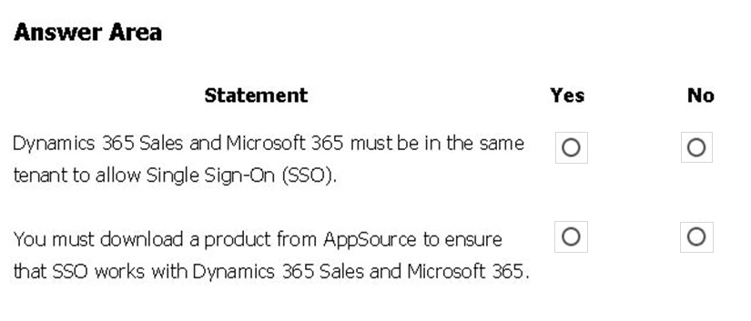

> **Discussion**
>
> "I think that Box 1:Yes "For Microsoft 365 subscribers, the Dynamics 365 Customer Engagement apps instance must be in the same tenant as your Microsoft 365 subscription. A user account in Active Directory can only sync with one tenant." https://docs.microsoft.com/en-us/learn/modules/designing-power-platform-deployments/3-planning-the-deployment
>
> 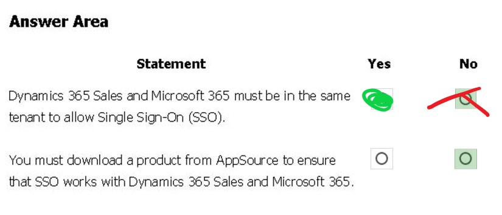

### 9

### 10

### 11

### 12

### 13

### 14

### 15

### 16 

### 17

### 18

### 19

### 20

### 21

### 22

### 23

### 24

### 25

### 26

### 27

### 28

### 29

### 30

### 31

### 32

### 33

### 34 

### 35

### 36

### 37

### 38

### 39

### 40

### 41

### 42

### 43

### 44

### 45

Your company wants to create a help desk system and implement Dynamics 365 Customer Service.
The company has the following requirements:
- Provide an application to allow support team staff to chat live with a customer.
- Automatically import data from a Microsoft Excel spreadsheet once a day.
- Provide a chatbot that can assist customers who need support.
You need to determine which applications to use to meet the requirements.
Which applications should you use? To answer, select the appropriate options in the answer area.
NOTE: Each correct selection is worth one point.
Hot Area:

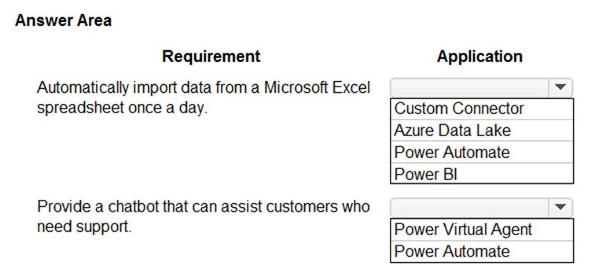

> **Site Answer:** 
> 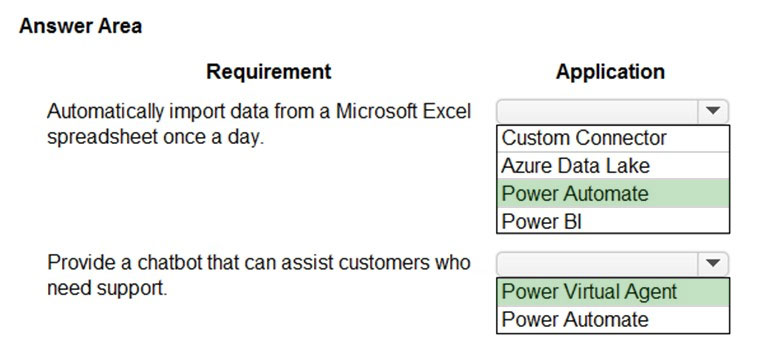
> Reference:
> https://docs.microsoft.com/en-us/power-virtual-agents/fundamentals-what-is-power-virtual-agents

### 46

You create a business rule on contact entity to enforce the requirement that users must enter either a telephone number, fax number, or an email when creating a new record.
The company decides to remove fax number from the condition.
You need to update the business rule.
What are two ways of achieving the goal? Each correct answer presents a complete solution.
NOTE: Each correct selection is worth one point.

- A. Save a copy of the rule and change the condition. Deactivate and delete the original rule.
- B. Deactivate the business rule and change the condition.
- C. Take a snapshot of the business rule and change the condition.
- D. Change the condition and activate the change.

> **DISCUSSION**
>
> AB (100%)
>
> Effective October 14, 2019, the rules feature in canvas apps is deprecated. More information: [Blog: Canvas Rules feature deprecation](https://powerapps.microsoft.com/blog/canvas-rules-feature-deprecation/).
>
> 
>
> **Correct Answer:** *AD* [🗳️](https://www.examtopics.com/exams/microsoft/pl-900/view/12/#)
> Reference:
> https://docs.microsoft.com/en-us/powerapps/maker/canvas-apps/working-with-rules

### 47

You create a Power BI dashboard. Match each option to its function. To answer, drag the appropriate option from the column on the left to its function on the right. Each option may be used once, more than once, or not at all.

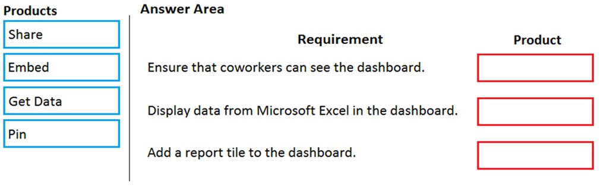

> **Correct Answer:** *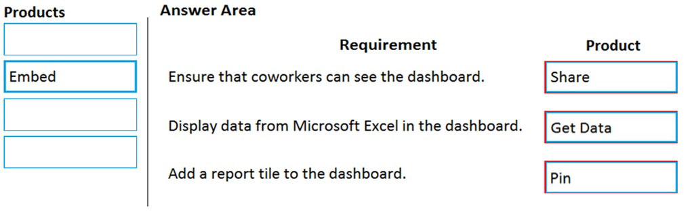*
> Reference:
>
> - https://docs.microsoft.com/en-us/power-bi/service-set-data-alerts https://docs.microsoft.com/en-us/power-bi/service-analyze-in-excel
> - https://docs.microsoft.com/en-us/power-bi/service-dashboard-pin-tile-from-report

### 48

You are using Dynamics 365 Sales.
You need to pull data into a Power BI report for your team. The City and State columns must be combined to form one column on the report.
Which function would you use? Each correct answer presents a complete solution.
NOTE: Each correct selection is worth one point.

- A. Use Power Query to merge columns.

- B. Import the data.

- C. Export data to Microsoft Excel.

- D. Create a view.

  

> **Correct Answer:** *A* [🗳️](https://www.examtopics.com/exams/microsoft/pl-900/view/12/#)
> Reference:
> https://docs.microsoft.com/en-us/power-bi/desktop-shape-and-combine-data

### 49

A carpet cleaning company uses Dynamics 365 Sales. The process for entering customer information during onsite sales calls is very complicated. The company wants a simplified screen that allows salespeople to capture the customer name, phone number, and other information while speaking to the customer. You need to recommend a solution that works on various types of mobile devices.
What should you recommend?

- A. Common Data Service
- B. Power Automate
- C. AI Builder
- D. Canvas app
- E. Power BI

> **Correct Answer:** *D* [🗳️](https://www.examtopics.com/exams/microsoft/pl-900/view/13/#)
> Reference:
> https://powerapps.microsoft.com/en-us/build-powerapps/

### 50

A company manages a chain of retail stores. The company stores a list of retail store names and numbers in one Power BI table. The company stores sales transaction data including a transaction ID in another table. The transaction ID includes the store number. You need to show the store name for all retail transactions in all Power BI reports. Which tool should you use?

- A. Query Editor
- B. Power BI Service
- C. Microsoft Excel
- D. Data Connector

> **Correct Answer:** *A* [🗳️](https://www.examtopics.com/exams/microsoft/pl-900/view/13/#)
> Power BI Desktop comes with Query Editor, where you can connect to one or many data sources, shape and transform the data to meet your needs, then load that model into Power BI Desktop.
> Reference:
> https://docs.microsoft.com/en-us/power-bi/desktop-query-overview

### 51

A company is using Power BI to build visualizations. The company's IT support team needs to know when to install Power BI Desktop on users' computers and where the Power BI Service will suffice to perform tasks.
You need to recommend solutions for the company. What should you recommend?

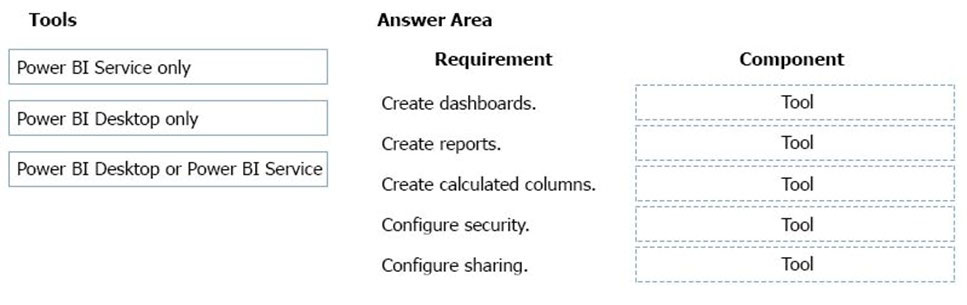

> **Correct Answer:** *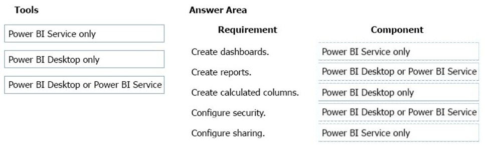*
> In a Venn diagram comparing Power BI Desktop and the Power BI service, the area in the middle shows how the two overlap. Some tasks you can do in either
> Power BI Desktop or the service. The two sides of the Venn diagram show the features that are unique to the application and the service.
> 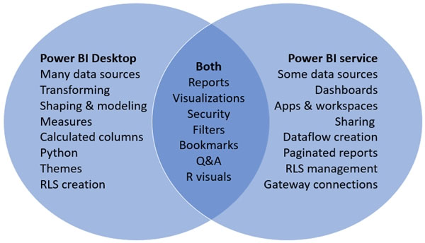
> Reference:
> https://docs.microsoft.com/en-us/power-bi/designer/service-service-vs-desktop

### 52

You need to display sales orders greater than a specific threshold in a Power BI report.
What should you use?

- A. filter
- B. Power Query
- C. Common Data Service
- D. connector

> **Correct Answer:** *A* [🗳️](https://www.examtopics.com/exams/microsoft/pl-900/view/13/#)

### 53

You are a sales representative. You create a Power BI report to visualize data from a Microsoft Excel workbook. Users need to be able to view and share the report. Which two actions should you perform? 

- A. Pin the report to a dashboard.
- B. Export the data.
- C. Publish the dashboard.
- D. Share the dashboard.

> **Correct Answer:** *AD* [🗳️](https://www.examtopics.com/exams/microsoft/pl-900/view/14/#)
> Reference:
>
> - https://docs.microsoft.com/en-us/power-bi/create-reports/service-dashboard-pin-live-tile-from-report 
> - https://docs.microsoft.com/en-us/power-bi/collaborate-share/service-share-dashboards#limitations-and-considerations

### 54

You create reports within Power BI to report on the status of a project. A manager asks you to share the reports with other team members. You decide to create a published app and set permissions to allow other team members to view the reports.
For each of the following statements, select Yes if the statement is true. Otherwise, select No.

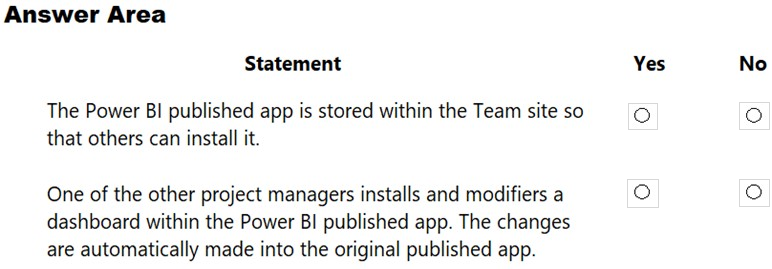

> **Correct Answer:** *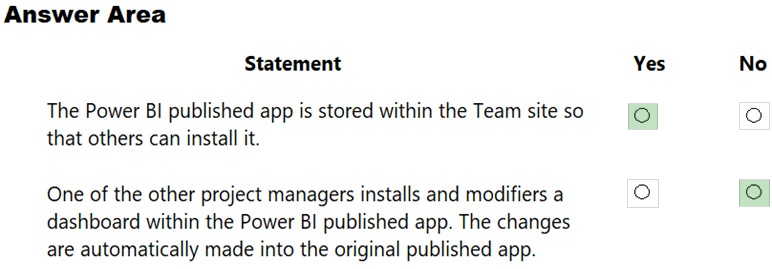*
> Reference:
> https://docs.microsoft.com/en-us/power-bi/collaborate-share/service-create-distribute-apps

### 55

A company plans to create an information portal that managers can use to view critical information about their teams. You need to recommend the type of Power BI components that the company should use.
What should you recommend? To answer, drag the appropriate component types to the correct requirements. Each component type may be used once, more than once, or not at all. You may need to drag the split bar between panes or scroll to view content.

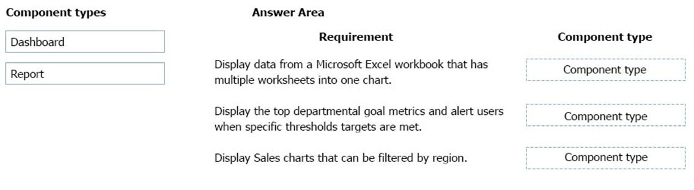

> **Correct Answer:** *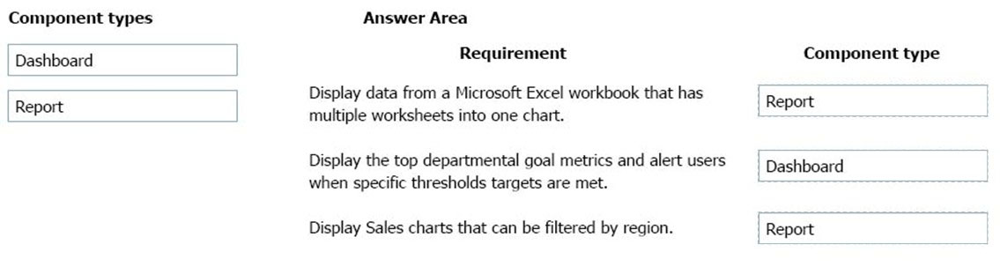*
> Box 1: Report -
> Reports are more detailed data displayed in many formats like chart, graphs list and in tabular, etc.
>
> Box 2: Dashboard -
> Dashboards are a business key performance indicator view where it displays key values that can change business profits and can be glanced at one screen.
>
> Box 3: Report -
> Power BI dashboards cannot slice and dice, but reports have many ways to filter and slice.
> Note: Power BI dashboards are one placeholder to display the most important decision-making facts to run a business. But reports are more detailed data displayed in many formats like chart, graphs list and in tabular, etc. Reports are based on one dataset or one business unit data for example reports of a store belonging to California.
> Reference:
> https://www.educba.com/power-bi-dashboard-vs-report/

### 56

You have a Power BI report. For each of the following statements, select Yes if the statement is true. Otherwise, select No.

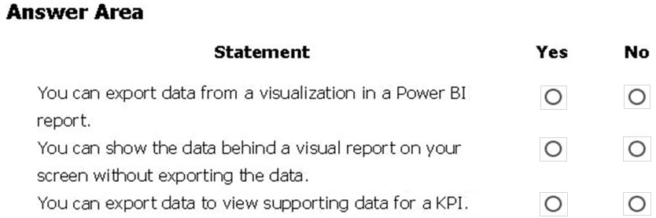

> **Discussion**
> Community Disagrees with answer 2
>
> ------
>
> **Answer**
> *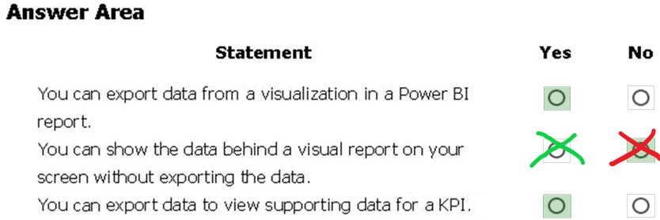*
> Box 1: Yes -
> If you'd like to see the data that Power BI uses to create a visualization, you can display that data in Power BI. You can also export that data to Excel as an .xlsx or
> .csv file. The option to export the data requires a Pro or Premium license and edit permissions to the dataset and report.
> Note: Export data from a Power BI dashboard
> \1. Select the ellipsis in the upper-right corner of the visualization.
> \2. Choose the Export data icon.
> \3. Power BI exports the data to a .csv file. If you've filtered the visualization, then the app will filter the downloaded data.
> \4. Your browser will prompt you to save the file. Once saved, open the .csv file in Excel.
>
> Box 2: No -
> Underlying data: Select this option if you want to see the data in the visual and additional data from the model (see chart below for details). If your visualization has an aggregate, selecting Underlying data removes the aggregate. When you select Export, Power BI exports the data to an .xlsx file and your browser prompts you to save the file. Once saved, open the file in Excel.
>
> Box 3: Yes -
> A KPI dataset needs to contain goal values for a KPI. If your dataset doesn't contain goal values, you can create them by adding an Excel sheet with goals to your data model or PBIX file.
> Note: A Key Performance Indicator (KPI) is a visual cue that communicates the amount of progress made toward a measurable goal.
>
> Reference:
> https://docs.microsoft.com/en-us/power-bi/visuals/power-bi-visualization-export-data https://docs.microsoft.com/en-us/power-bi/visuals/power-bi-visualization-kpi

### 57

You create a Power BI dashboard that displays data from Dynamics 365 Customer Engagement.
You need to share the Power BI dashboard with coworkers.
What are three possible ways to achieve the goal? Each correct answer presents a complete solution.
NOTE: Each correct selection is worth one point.

- A. Create a Power BI workspace and grant coworkers permissions.
- B. Publish the dashboard as an app to your coworkers.
- C. Export the data into Common Data Service for others to manipulate in Power BI.
- D. Export the data to Microsoft Excel for coworkers to import and view in Power BI.
- E. Embed reports in your company's internal web portal.

> **Discussion**
>
> My Notes: C and D would always be out of date data
>
> Community notes:
>
> "B. Publish the dashboard as an app to your coworkers." Workspaces are published as apps, not Dashboards directly. You need to account for what else is in the workspace before determining if you want to publish it, or create a new separate workspace for any application that you will share
>
> "B. Publish the dashboard as an app to your coworkers." Since when this capability is added to Power BI? Can we publish dashboard in power bi? The Power BI Desktop application only allows you to build and publish reports. Once you have published this to the Web Service, you can then create dashboards there. An easy way is to simply start pinning visuals from any report page. https://community.powerbi.com/t5/Desktop/How-to-publish-a-dashboard/m-p/170688
>
> -----
>
> **Correct Answer:** *ABE* [🗳️](https://www.examtopics.com/exams/microsoft/pl-900/view/15/#) **B???**
> A: Basic Sharing for Dashboards and Reports through a workspace is the most common way of sharing the Power BI content. Basic Sharing is very simple and easy to use method. You can simply click on the Share button in the dashboard or report, and then share it with other users.
> 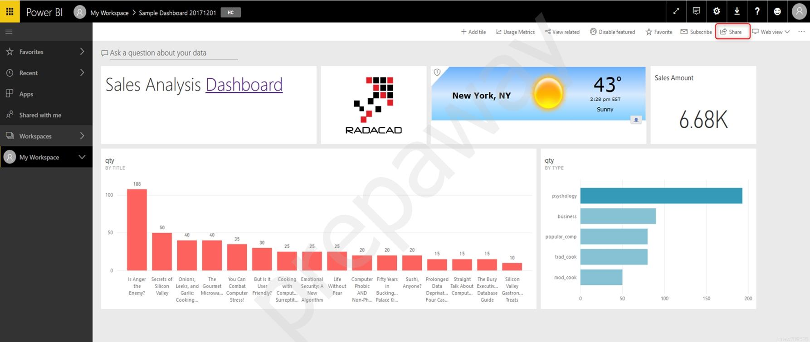
> B: Apps are great sharing method for multiple environment, and best way of sharing for users in production environment.
> Power BI App is the solution for multiple environment approach. With Power BI App, your development environment (workspace), and user environment (App) are isolated from each other.
> Note: If you are using SharePoint online as a portal for document management and some other reasons already, then consider using Embed in SharePoint Online feature of Power BI reports. This method is secure and you can share the report only with Power BI users you want.
> E: Sometimes, you donג€™t need a secure way of sharing, you may search for an easy and free way of sharing, and your content is not confidential or sensitive.
> Publish to web is your friend in such situation. This is the only free way of sharing in Power BI, but be aware that this method is not secure.
> Publish to web method, gives you an embed code, which you can use in any web pages to embed the Power BI report in it
> Reference:
> https://radacad.com/power-bi-sharing-methods-comparison-all-in-one-review

### 58 

Your company has an on-premises Microsoft SQL Server database that contains legacy sales data. You must display information from the database in a new Power Apps app. You need to establish a secure connection between the database and the app. What should you use?

- A. Data source
- B. App
- C. Data gateway
- D. Power Automate

> **Correct Answer:** *C* [🗳️](https://www.examtopics.com/exams/microsoft/pl-900/view/15/#)
> For an on-premises database, identify a data gateway that was shared with you (or create one).
> Specify Connect using on-premises data gateway, type or paste the server name, the database name, the user name, and the password for the database that you want to use, and specify the authentication type and the gateway.
> Reference:
> https://docs.microsoft.com/en-us/powerapps/maker/canvas-apps/connections/connection-azure-sqldatabase

### 59 

A recent update has been made to a canvas app. The update causes usability issues. You need to roll back the app to a previous version. What should you do?

- A. Restore the previous version of the app.
- B. Uninstall the app for all users and reinstall by using the package from a previous version.
- C. Deactivate the live app, import the previous version of the app, and then activate the app.
- D. Delete the app and create a new app based on the previous version.

> **Correct Answer:** *A* [🗳️](https://www.examtopics.com/exams/microsoft/pl-900/view/15/#)
> Restore a canvas app to a previous version in PowerApps.
> Restore an app from your account
> \1. Open powerapps.com, and then click or tap Apps in the left navigation bar.
> \2. Near the right edge, click or tap the info icon for the app that you want to restore.
> \3. Click or tap the Versions tab, and then click or tap Restore for the version that you want to restore.
> \4. In the confirmation dialog box, click or tap Restore.
> A new version is added to your list.
> Reference:
> https://docs.microsoft.com/en-us/powerapps/maker/canvas-apps/restore-an-app

### 60

You are a district manager for a large retail organization. You train each store manager to use Power BI to track sales and daily sales targets. A store manager remembers learning about the Analyze in Excel option but cannot find the option in their Power BI dashboard. You need to help the user resolve the issue.
How should you advise the user?

- A. Install the Power BI Desktop app.
- B. Select the Spotlight button on the dashboard tile.
- C. Subscribe to the dashboard and follow the email link.
- D. Navigate to the report used by the dashboard.

> **Correct Answer:** *D* [🗳️](https://www.examtopics.com/exams/microsoft/pl-900/view/15/#)
> Reference:
> https://docs.microsoft.com/en-us/power-bi/collaborate-share/service-analyze-in-excel

### 61

You are a district manager for a large retail company. You want to provide sales managers with deeper sales insights to ensure that they can make more informed decisions for their stores. Store managers must be able to view data in near real-time. You need to create and share a Power BI dashboard that can be used by the store managers. Which tools can you use? To answer, drag the appropriate reporting types to the correct requirements. Each reporting type may be used once, more than once, or not at all. You may need to drag the split bar between panes or scroll to view content.

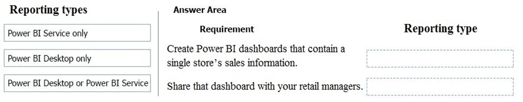

> See 51: Visualizations should be only in BI Service

### 61

A company uses Microsoft Excel workbooks to store consolidated sales data. Workbooks are stored on OneDrive for Business. Match each Power BI feature to its requirement. To answer, drag the appropriate features from the column on the left to its requirement on the right. Each option may be used once, more than once, or not at all.

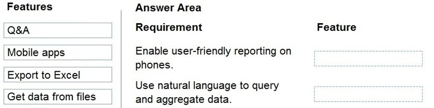

> **Correct Answer:** *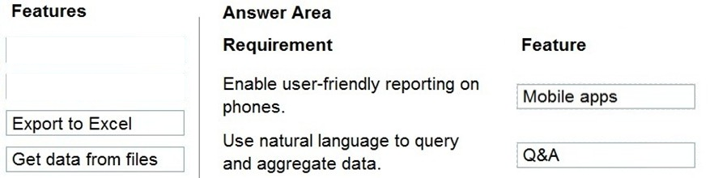*
> Reference:
> https://docs.microsoft.com/en-us/power-bi/consumer/mobile/mobile-reports-in-the-mobile-apps https://docs.microsoft.com/en-us/power-bi/create-reports/power-bi-tutorial-q-and-a#:~:text=Sometimes%20the%20fastest%20way%20to,data%20in%20your%
> 20own%20words.&text=The%20second%20part%20shows%20what,service%20or%20Power%20BI%20Desktop.

### 63

A company plans to display support call metrics on a screen that is visible to all call center staff.
You need to recommend solutions to meet the company's requirements. What should you recommend? To answer, drag the appropriate components to the correct requirements. Each component may be used once, more than once, or not at all. 

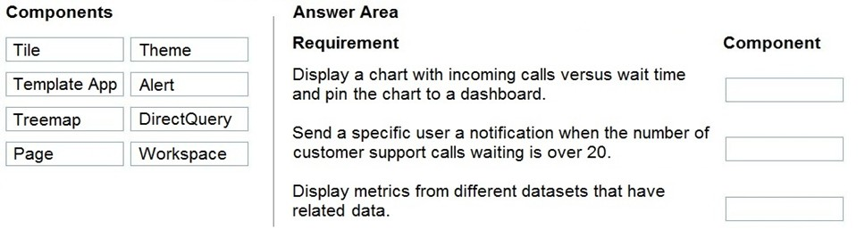

> **Discussion**:
>
> Community: Either Page or Direct Query for the last one
>
> ----
>
> **Site Answer:** *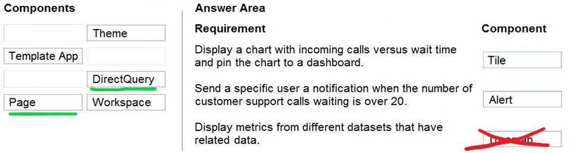*
> Reference:
> https://docs.microsoft.com/en-us/power-bi/create-reports/service-dashboard-tiles https://docs.microsoft.com/en-us/power-bi/create-reports/service-set-data-alerts https://docs.microsoft.com/en-us/power-bi/visuals/power-bi-visualization-treemaps

### 64

You create a Power BI dashboard that displays Common Data Model data.
You need to share the Power BI dashboard with coworkers and allow the coworkers to collaborate.
What are two possible ways to achieve the goal? Each correct answer presents a complete solution.

- A. Create a Power BI workspace and grant coworkers permissions.
- B. Publish the dashboard as an app to your coworkers.
- C. Export the data to Microsoft Excel. Make required changes and then re-import the data.
- D. Create a Power Automate flow to export the data into a SQL Server database.

> **Correct Answer:** *AB* [🗳️](https://www.examtopics.com/exams/microsoft/pl-900/view/16/#)
> Reference:
> https://docs.microsoft.com/en-us/power-bi/collaborate-share/service-create-the-new-workspaces

### 65

You are using Dynamics 365 Sales.
You need to create a Power BI report that includes customer office locations. The City and State columns must be combined to form one column on the report.
What should you do?

- A. Use Power Query Editor to merge columns.
- B. Import the data.
- C. Export data to Microsoft Excel.
- D. Create a view.

> **Correct Answer:** *A* [🗳️](https://www.examtopics.com/exams/microsoft/pl-900/view/17/#)
> Reference:
> https://support.microsoft.com/en-us/office/merge-columns-power-query-80ec9e1e-1eb6-4048-b500-d5d42d9f0a8d

### 66

A company needs to create a series of mobile applications to empower their field engineers to accomplish several tasks with varying degrees of complexity. Match each app type to its definition. To answer, drag the appropriate app type from the column on the left to its definition on the right. Each app type may be used once, more than once, or not at all.

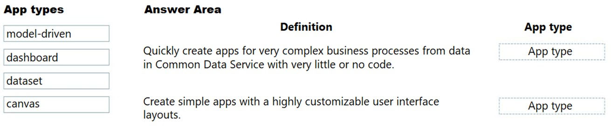

> **Correct Answer:** *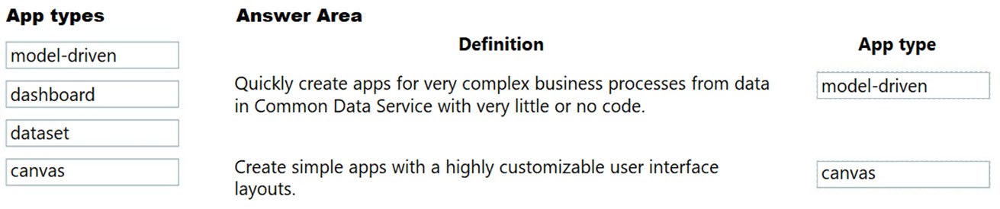*
> Box 1: model-driven -
> Both model-driven and canvas apps allow you to easily build business apps. They both share access to the Common Data Service providing standard and custom entities. Model-driven apps start with your data model building up from the shape of your core business data and processes in the Common Data
> Service to model forms, views, and other components. Model-driven apps automatically generate great UI that is responsive across devices.
>
> Box 2: canvas -
> Canvas apps start with your user experience, crafting a highly tailored interface with the power of a blank canvas and connecting it to 200 data sources. Canvas apps can be built for web, mobile, and tablet applications.
> Reference:
> https://powerapps.microsoft.com/sv-se/blog/introducing-model-driven-apps/

### 67

A user is starting to learn about Power Apps. Which objects should you use? To answer, select the appropriate options in the answer area.

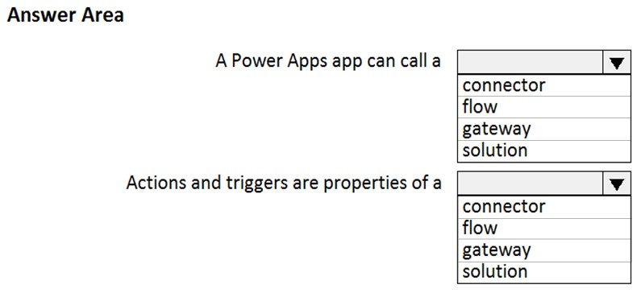

> **Correct Answer:** *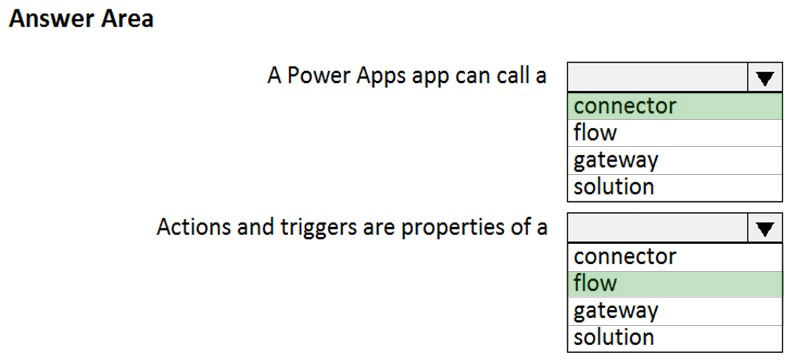*
> Reference:
> https://docs.microsoft.com/en-us/powerapps/powerapps-overview https://docs.microsoft.com/en-us/power-automate/getting-started

### 68

What is a benefit of deploying Microsoft 365 and Dynamics 365 apps in the same tenant?

- A. You do not need to manually back up data.
- B. Both will use the same time zone.
- C. You can use Power BI to display data that comes from both environments.
- D. You can implement Single Sign-On (SSO).

> **Discussion**
>
> Correct answer is D
>
> Community: "To use data from different sources, PBI don't need to be on same tenant, because you can use them just with different credentials for each of them. In my opinion D (SSO) then."
>
> -----
>
> **Correct Answer:** *C* [🗳️](https://www.examtopics.com/exams/microsoft/pl-900/view/17/#)
> Reference:
> https://docs.microsoft.com/en-us/power-platform/admin/use-power-bi

